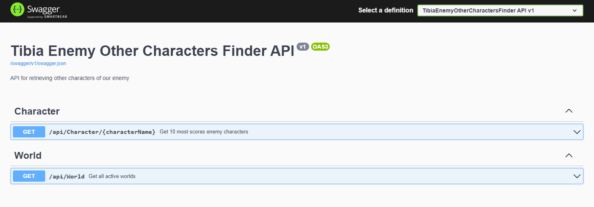
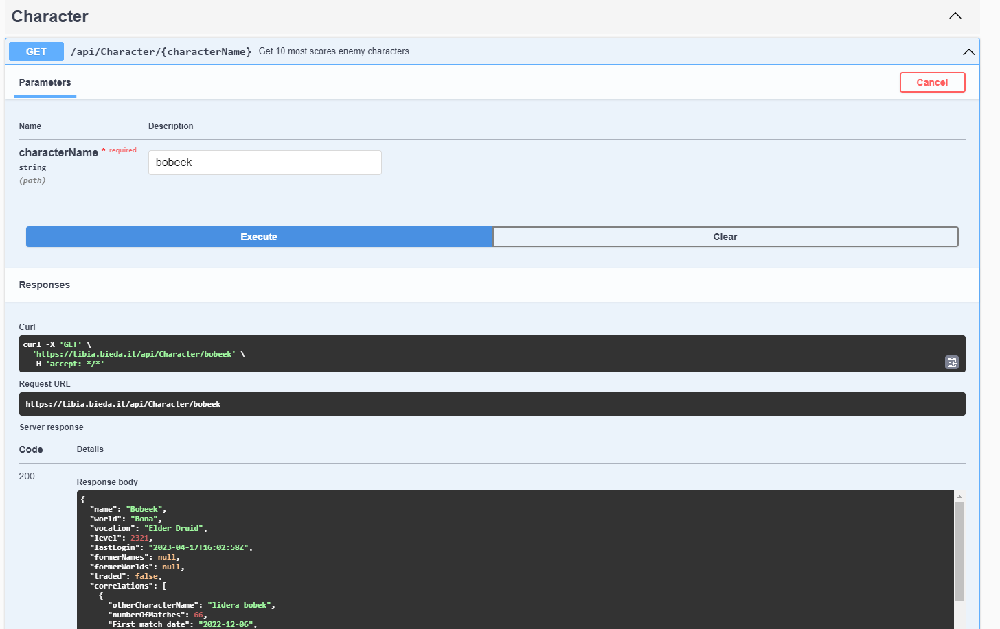
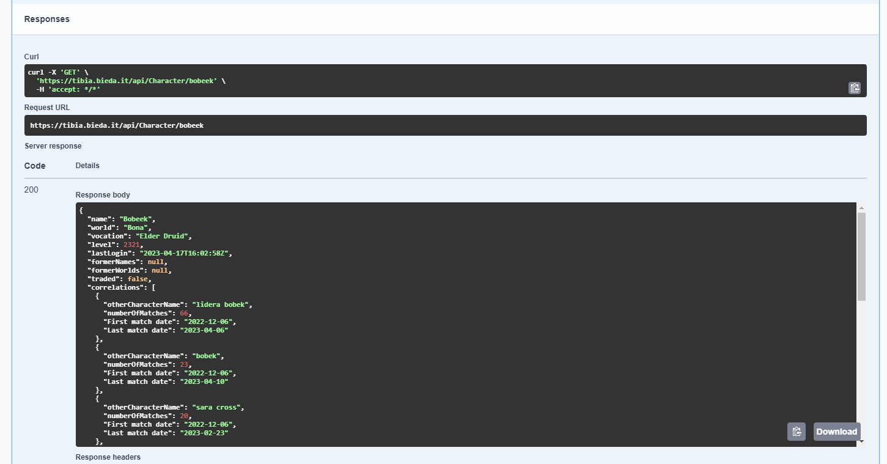

# _Tibia Enemy Other Characters Finder_

<table>
    <tr>
        <td>
            Tibia Enemy Other Characters Finder is a simple ASP.NET Api that helps players to detect other characters of your enemy.
        </td>
    </tr>
</table>

### Web Api
You can check out https://tibia.bieda.it/

---
## Table of Contents
* [General Info](#general-information)
* [Technologies Used](#technologies-used)
* [Features](#features)
* [Screenshots](#screenshots)
* [Setup](#setup)
* [Usage](#usage)
* [Project Status](#project-status)
* [Room for Improvement](#room-for-improvement)
* [Contact](#contact)
* [License](#license)

---
## General Information
#### Dear Tibia Players ! 
- Have you ever been killed or cheated by some noob character and you want revenge on his main character ? 

- Now it's possible! Application gives opportunity to find all characters of the same player. Just type your suspect character name and it gives you list of most possible other characters.

#### Important!
- You have to remember that application does not have 100% sure of other character match, it is only sugestion based on propability.
The more player plays, the more likely result will be close to true.

---
## Technologies Used
- ASP.NET Core 7.0
- C# 11.0
- EF Core 7.0
- Postgres - version 14.2
- TestContainers - documentation [_here_](https://github.com/testcontainers/testcontainers-dotnet)
- BenchmarkDotNet
- Dapper
- Moq
- Serilog
- Seq - documentation [_here_](https://docs.datalust.co/docs) , license [_here_](https://datalust.co/pricing)
- Swagger - documentation [_here_](https://swagger.io/docs/)
- Xunit
- MediatR
- FluentAssertions
- Autofac

---
## Features
**List the ready features here:**
- All data analyser mechanism with optimization data storage
- GetCharacterController - return character info + other characters
- GetWorldsController - return list of currently scanning worlds

---
## Screenshots

<h4 align="center">Swagger Api view</h>

<h4 align="center">Character Controller</h>

 

<h4 align="center">Example result</h>

---
## Setup

### Project require 
1. SDK version 7.0.x or higher ( instruction for Windows/Linux/macOS [_here_](https://dotnet.microsoft.com/en-us/download/dotnet/7.0) )
2. ASP.NET Core Runtime version 7.0.x or higher ( instruction for Windows/Linux/macOS [_here_](https://dotnet.microsoft.com/en-us/download/dotnet/7.0) )
3. Clone repository `git clone https://github.com/kamiljanek/Tibia-EnemyOtherCharactersFinder.git`
4. Seq enviroment on Windows [_here_](https://docs.datalust.co/docs/getting-started) or docker container [_here_](https://docs.datalust.co/docs/getting-started-with-docker)
5. Your own Postgres Database
6. Configure `appsettings.json` or if you have Development enviroment copy `appsettings.Development-template.json` change file name to `appsettings.Development.json` and input your secrets
7. Configure `launchSettings.json`

---

## [Usage](https://github.com/kamiljanek/Tibia-EnemyOtherCharactersFinder)

1. Firstly you need to build project - go into repo directory, open CMD and type (`dotnet build`)
2. Next you should run `TibiaEnemyOtherCharactersFinder.Api` to add all migrations - go into project directory, open CMD and type `dotnet run`
3. Last step is to configure `cron` on your machine with periods as below:

- `CharacterAnalyser` - (`dotnet run`) - ones per day
- `WorldScanSeeder` - (`dotnet run`) - minimum ones per 5 min
- `DbCleaner` - (`dotnet run`) - ones per day/week
- `WorldSeeder` - (`dotnet run`) - best practise ones per day

### Development
Want to contribute? Great!

To fix a bug, enhance an existing module or add something new, follow these steps:

- Fork the repo
- Create a new branch (`git checkout -b feature/<new_feature_or_improve_name>`)
- Make the appropriate changes in the files
- Add changes to reflect the changes made
- Commit your changes (`git commit -am 'Add xxx feature'`)
- Push to the branch (`git push origin feature/<new_feature_or_improve_name>`)
- Create a Pull Request

---
## Project Status

Project is: _still in progress_ . 

---
## Room for Improvement

### To do:
- Add automatic contenerized
- Add autorization and autentication
- Add "changing character name"
- Add "character trade"

---
## License

You can check out the full license [_here_](LICENSE.md)

This project is licensed under the terms of the **_MIT_** license.

>Created by [@kamiljanek](https://github.com/kamiljanek) GitHub
